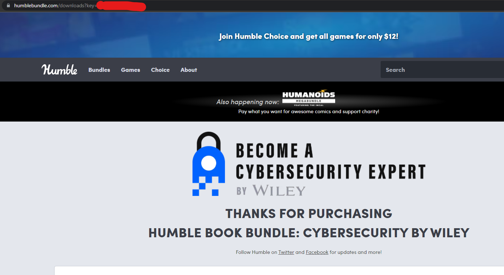

# CLI for getting your Humble Bundle Books
- It's a script that I wrote to get books from Humble Bundle automatically
- Makes a folder then  grabs all of the formats for each book and puts it in it
- It's using humble bundle api https://www.humblebundle.com/api/v1/order/key?wallet_data=true

## How to use it?
In order to use this script, you would need to have a humble bundle key.

You can get it by checking the URL right after buying your bundle.


```bash
https://www.humblebundle.com/downloads?key=YOUR_KEY
```


```
$ python humbleGet.py your_key
```
